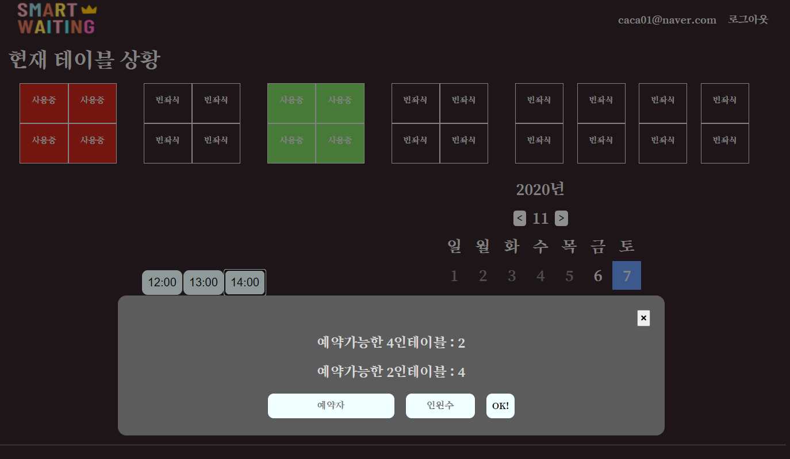
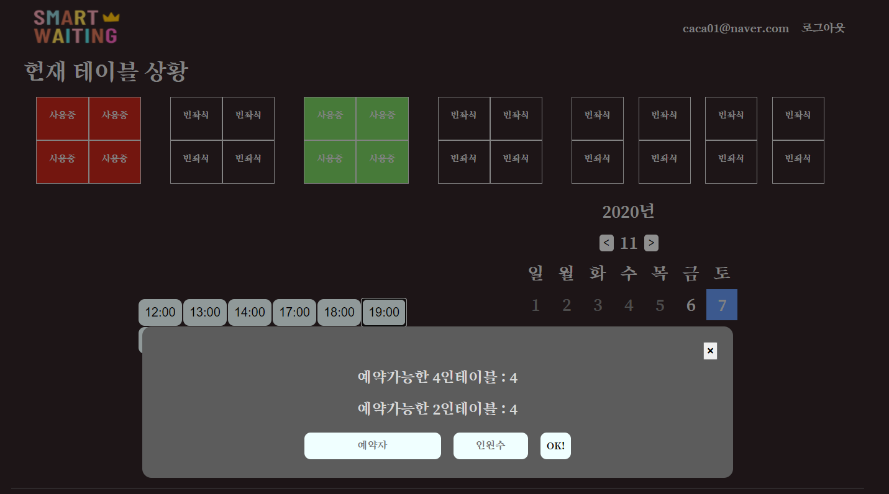
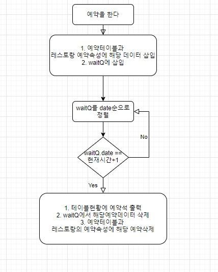
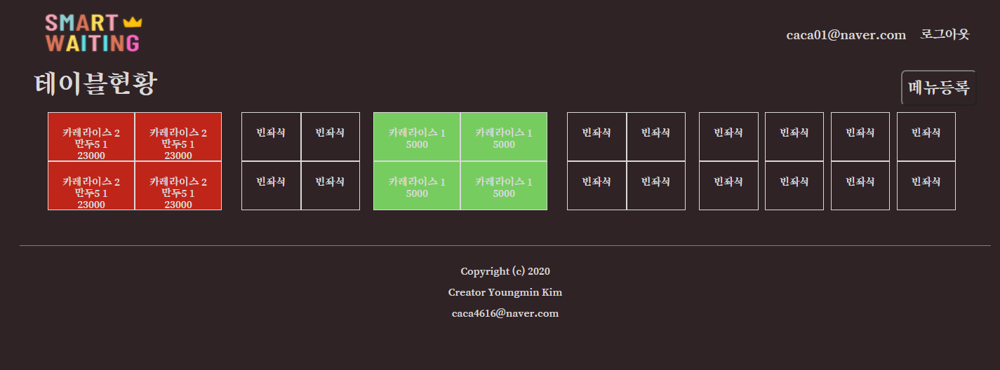
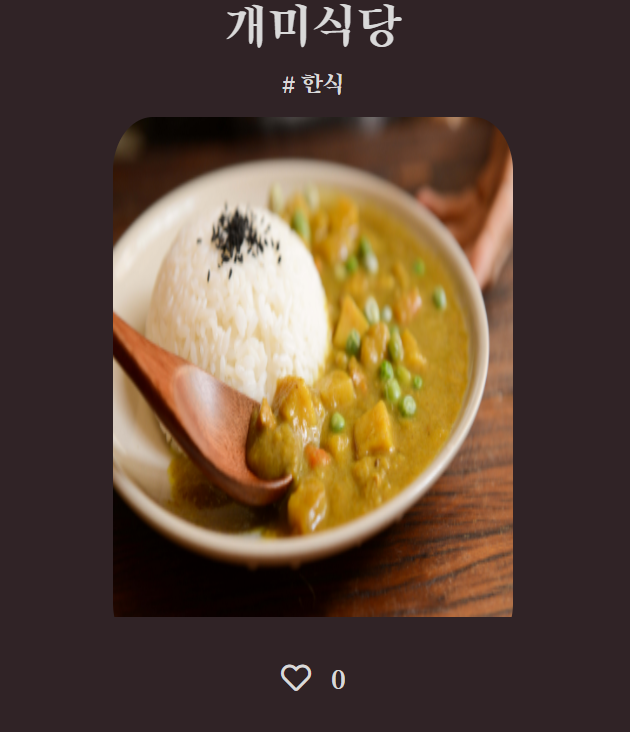
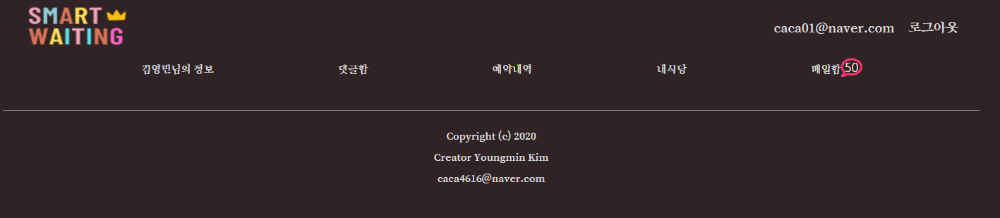
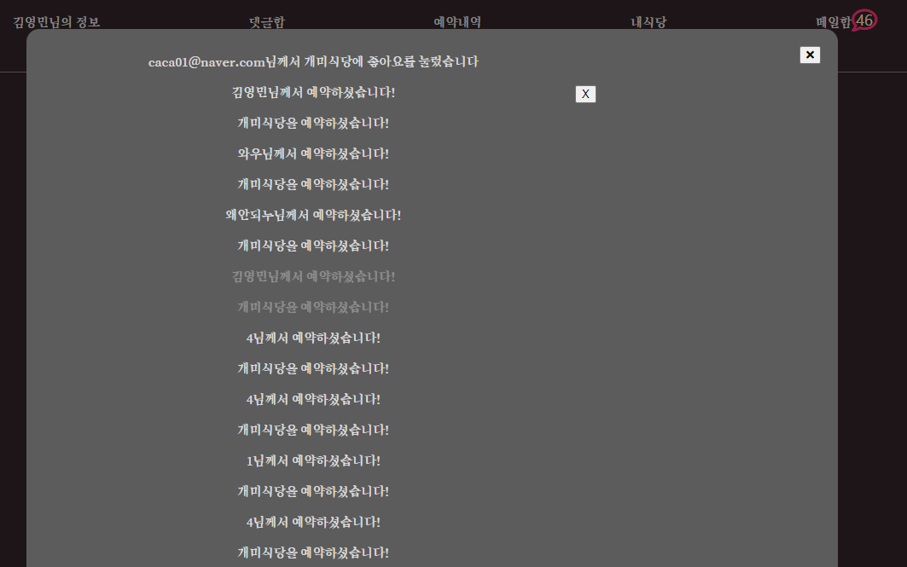

# SmartWaiting

## 1. 만들게 된 계기
 [Benzaiten](https://github.com/Nanzini/Benzaiten) 프로젝트를 진행하면서 `이런 기능이 추가되면 더 좋을텐데` 라는 생각을 계속 해왔었고 조금 더 규모있는 프로젝트를 해보고 싶고 이왕 만드는 거 제대로 된 기능을 만들어보자는 마음으로 시작하게 되었다. (feat. 渡辺将平　松岡博史)
 
부족한 점이 많은 프로젝트이지만 다음 프로젝트에서는 현재보다 나은 퀄리티가 될 수 있도록 노력할 것이다.  

(!주의! 메일함 메일 UI가 지저분할 수있습니다. 테이블현황에서 테이블의 개수는  4인테이블 4개 2인테이블 4개가 최적입니다 unresponsive. 15인치 화면에 최적화되어있습니다.)
 
  

## 2. 프로그램 설명

* (unreponsive)
  

* [Demo1 ](http://180.92.112.23:8080) (Demo는 구직기간에 한해서 오픈합니다)
* [Demo2 ](http://180.92.112.23:8000) 
 (Demo는 구직기간에 한해서 오픈합니다)

  

## 3. 주요기능

---

 ##   modal popup

 해당 엘리먼트에 대한 modal popup이 지정되어 있습니다. 1번 엘리먼트를 누르면 1번 엘리먼트에 해당하는 modal popup이 나와야 합니다. 이때, event.target을 사용하여 각 엘리먼트에 해당하는 모달을 추적해서 나오는 방식으로 구현하였습니다.

  

아래의 사진은 2020년 11월 7일 14:00자 예약을 눌렀을 때 화면입니다.
예약가능한 4인테이블이 2개 남았는 것을 알 수 있습니다.

  

그리고 아래의 사진은 2020년 11월 7일 18:00자 예약현황입니다.
클릭한 날짜에 따라 그 해당 날짜에 대한 예약현황을 서버에서 AJAX통신으로 데이터를 받아온 후 리턴합니다.

   

 ## 예약방식
  

예약을 할 때에는 다음과 같은 로직이 실행됩니다.

예약을 할 때에는 예약데이터가 키값으로 1:N의 관계를 가집니다. 2020년 11월 6일 18시 예약을 예로들면 `2020110618` 이라는 key값은 하나 뿐이지만 거기에 대응되는 예약건수들은 N이 되죠. 데이터베이스에 해당 예약날짜로 쿼리를 요청하고 수정하고 삽입하고 삭제하는 구조입니다.

그리고 예약과정이 모두 완료되기에는 waitQ라는 녀석을 거쳐야합니다. waitQ는 예약데이터들이 들어가는 곳이라고 보면 되는데, waitQ에 객체가 들어오면 예약날짜순으로 정렬을 합니다. 그러곤 맨 처음 객체의 예약시간과 현재시간을 비교합니다. 1시간 전이라면 waitQ에서 퇴출시키고 예약테이블의 데이터를 삭제하고 최종적으로 테이블현황에 예약석으로 수정합니다

  

 ##  테이블색칠
  
 
테이블에 주문이 들어가고 난 후부터 타이머가 작동합니다. 이 타이머는 해당 테이블의 주문시간과 현재시간을 비교하여 0~20분 차이일 때는 초록색, 20~40분일 때는 노란색, 그 외에는 빨간색으로 테이블을 색칠합니다.  
 이는 웹페이지에 접속한 유저가 손님이 주문한 지 몇 분이 지났는 지 알 수 있기 때문에 언제쯤에는 이 자리가 빌 것이다라는 유추를 할 수 있게 도와줍니다.  
 자리가 언제쯤 생길 지에 중요한 단서라고 생각합니다.  

 

   

 ## 좋아요기능
  
 
레스토랑의 평가를 남길 때 좋아요기능을 만들면 재미있고 근사할 것 같아 구현해보았습니다. 
 
한 유저는 한 레스토랑에 1번밖에 좋아요를 누를 수 없고 
 
새로고침을 했을 때 그 정보를 유지하고 있어야 합니다. 
 
좋아요가 눌린상태는 하트가 색칠된 상태이고 그 상태에서 한번 더 누르면 빈 하트가 되면서 좋아요 숫자는 1이 내려갑니다.

 
 모든 로직은 AJAX로 통신합니다.

 

   

 ## 메일함
  
 
예약을 하고 댓글을 남기고 좋아요를 누르고 예약을 취소할 때 모두 액션과 관련되는 사람에게 알림이 가고 사인을 보내야 한다고 생각했습니다. 그렇지 않으면 예약이 취소됐는 지 모르고 예약석을 준비할지도 모르기 때문이죠. 
이러한 알림기능은 상당히 중요한 부분이라고 생각하였고 이 메일함이 그 역할을 해줄 것입니다. 

메일함은 기본적으로 알림이 오면 알림이 온 갯수만큼 메일함 밖에서 표시해줍니다.
 

   
그러고 나서는 메일을 읽으면 읽는 대로 메일헤드가 회색으로 변하고 메일함의 숫자가 -1이 됩니다. 이는 AJAX통신으로 mail Table의 읽음여부가 true로 변환되어 야기되는 일입니다.
 
메일헤드에 커서를 올리면 메일삭제버튼이 나오고 이 버튼역시 AJAX로 통신합니다.

 

---

  

## 끝으로 . . .

 

끝은 또 다른 새로운 시작이라고 생각합니다.

막상 끝내고 보니 부족한 점이 너무 많은 프로젝트였네요.

뿌듯함이 20이라면 아쉬움이 80인 프로젝트였어요.

다음 프로젝트는 아쉬움이 60을 목표로!
